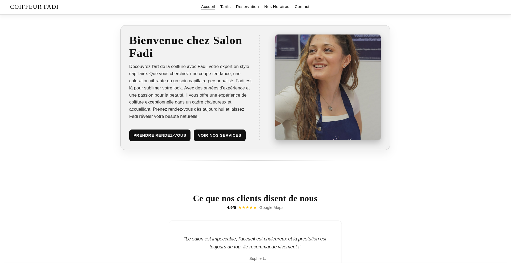
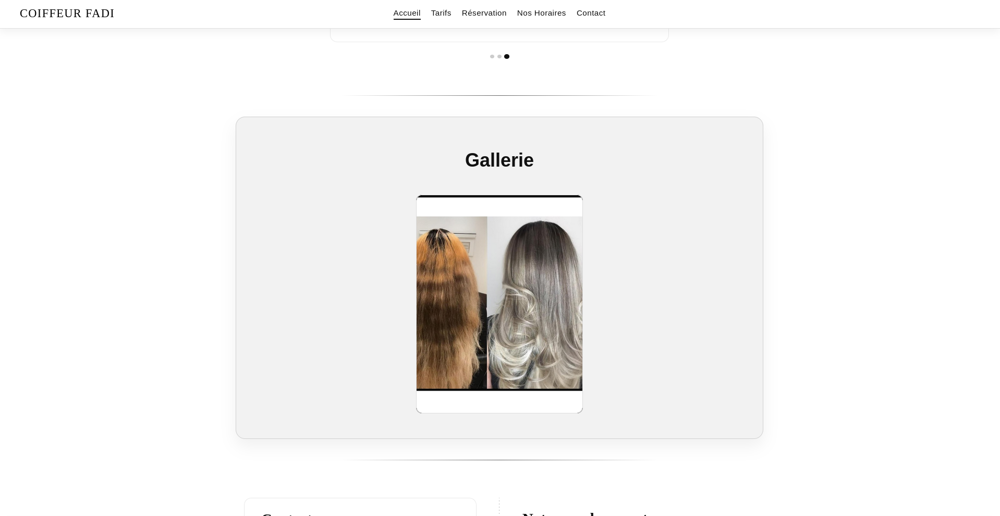
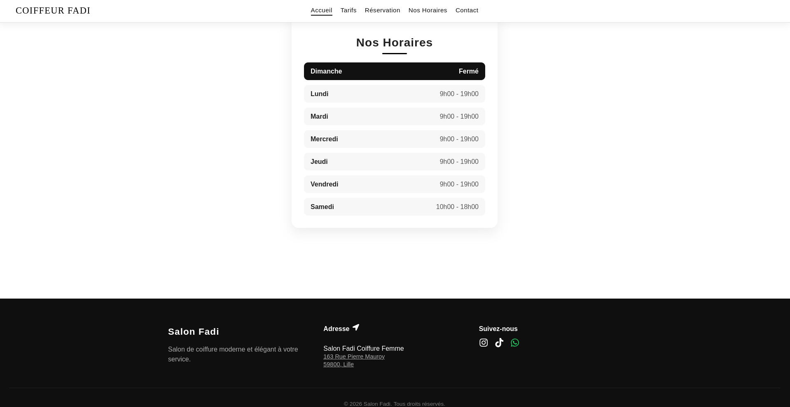
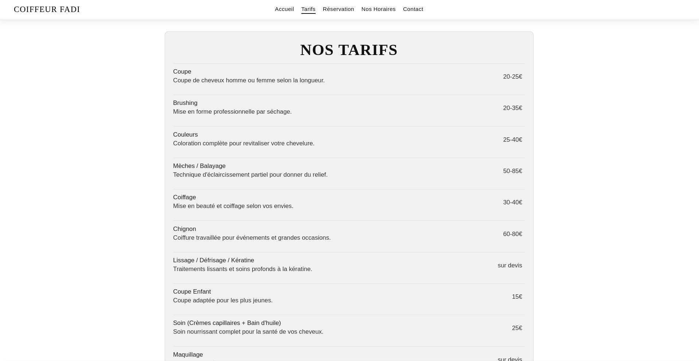
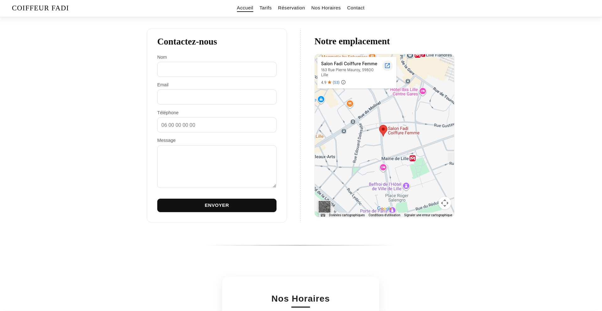

# Salon Fadi

A modern web application developed for **Salon Fadi**, a hair salon website designed to present the salon's services, information, and contact details through a clean and responsive interface.

## 🚀 Features

- Responsive design for desktop and mobile
- Presentation of salon services
- Modern and user-friendly interface
- Contact and salon information
- Interactive React components
- Responsive navigation

## 🛠️ Technologies

- **React**
- **JavaScript**
- **HTML5**
- **CSS3**
- **Create React App**

## 📸 Screenshots

### Homepage





### Services



### Contact



## ⚙️ Installation

Clone the repository:

```bash
git clone <repository-url>
cd coiffeur-fadi
```

Install the dependencies:

```bash
npm install
```

Start the development server:

```bash
npm start
```

The application will be available at:

```text
http://localhost:3000
```

## 📦 Build

To create a production build:

```bash
npm run build
```

The production files will be generated in the `build` directory.

## 📁 Project Structure

```text
coiffeur-fadi/
├── public/
├── src/
│   ├── components/
│   ├── ...
│   └── App.js
├── package.json
└── README.md
```

## 👨‍💻 Author

**Elyes Guedria**
